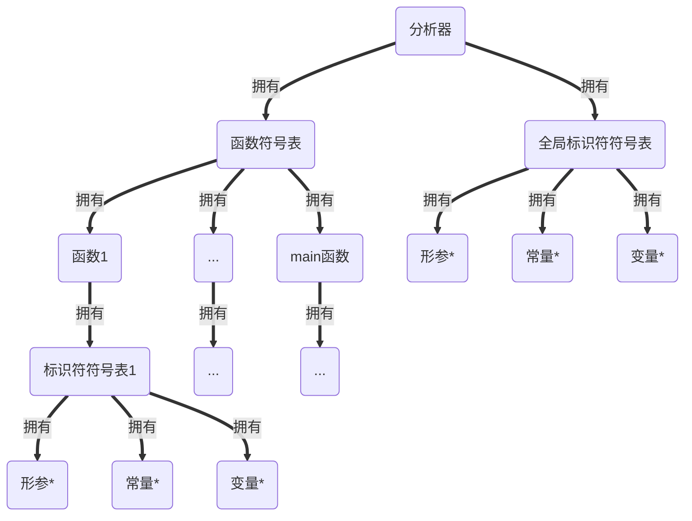

# BUAA_Compiler2020
2020北航编译技术实验部分个人作业

## 词法分析设计文档

### 编码前设计

编码前，老师要求我们完成了《编译技术》书第73页的第三题。第71到72页有对此题十分详细的顶层代码解答。总的来说，程序的逻辑是读入字符后分情况讨论，输出一个类别符`symbol`作为返回值。本题亦是如此，只是类型变得很多，同时对输出有一定要求，大致逻辑是不变的。我首先定义了一个`enum`类型并将`symbol`作为此类型的变量，这样可以直接用`symbol`作为下标输出一个存有类型值的字符串数组。然后再声明各种可能的符号判别函数，并在`getsym`函数中使用，最后一一完成各函数的定义。主函数中循环使用`getsym`函数直到读取到EOF。

```c++
#define TRUE        1
#define FALSE       0
#define _CRT_SECURE_NO_WARNINGS
#include <stdio.h>
#include <string.h>
#include <ctype.h>
#include <string>
#include <iostream>
#include <fstream>
using namespace std;
enum category
{
	IDENFR = 0, INTCON, CHARCON, STRCON, CONSTTK, INTTK, CHARTK, VOIDTK, MAINTK, IFTK,
	ELSETK, SWITCHTK, CASETK, DEFAULTTK, WHILETK, FORTK, SCANFTK, PRINTFTK, RETURNTK, PLUS,
	MINU, MULT, DIV, LSS, LEQ, GRE, GEQ, EQL, NEQ, COLON,
	ASSIGN, SEMICN, COMMA, LPARENT, RPARENT, LBRACK, RBRACK, LBRACE, RBRACE
} symbol;
char categoryString[39][10]
= { "IDENFR","INTCON","CHARCON","STRCON","CONSTTK","INTTK","CHARTK","VOIDTK","MAINTK","IFTK",
"ELSETK", "SWITCHTK", "CASETK", "DEFAULTTK","WHILETK","FORTK","SCANFTK","PRINTFTK","RETURNTK","PLUS",
"MINU","MULT","DIV","LSS","LEQ","GRE","GEQ","EQL","NEQ","COLON",
"ASSIGN","SEMICN","COMMA","LPARENT","RPARENT","LBRACK","RBRACK","LBRACE","RBRACE"
};
char reserves[15][10]
= { "const","int","char","void","main","if","else","switch","case",
	"default","while","for","scanf","printf","return"
};
int  num;
char Char;
char lastChar;
char tokenToLower[128];
char token[128];
int  pointer;
int  line;
string ans;
int getChar(FILE* stream);
void clearToken();
int isSpace();
int isLetter(), isDigit();
int isColon(), isComma(), isSemi(), isQuote(), isApostrophe();
int isEqu(), isGre(), isLss(), isExcla();
int isPlus(), isMinus(), isDivi(), isMult();
int isLpar(), isRpar(), isLbrack(), isRbrack(), isLbrace(), isRbrace();
void catToken();
void retract();
int reserver(), transNum(), isEof();
void error();
int getsym(FILE* stream)；
```

### 编码后设计

在VS19编程环境下发现，使用`fopen`会提醒如下错误：

```c
'fopen': This function or variable may be unsafe. Consider using fopen_s instead. To disable deprecation, use _CRT_SECURE_NO_WARNINGS. See online help for details.	LexicalAnalysis	lex.cpp	390	
```

虽然后来在群上同学的提醒下使用`#define _CRT_SECURE_NO_WARNINGS`会避免报错，然而我首先尝试改用C++完成代码。在一个下午的速成学习中，我逐渐学会使用输入输出流来打印字符，但是还是觉得纯粹用`fstream`输入对字符串的控制不够精细，尤其是如果想要通过空格来判断字符串是否结束是十分困难的，输入流会直接吞掉空字符。所以我改回使用`fgetc()`来读字符，用`ofstream`来输出，十分方便。在调试过程中，逐渐习惯了VS19的操作，同时发现了很多细节上的bug，尤其是对词法理解上的问题，不过我的代码比较冗长，因为想使用较为工整的格式，对于很多地方写的不够简洁，足足有四百余行。不过我为报错提供了接口，方便后续添加，同时代码较为易读，后续会延续这种风格。

## 语法分析设计文档

### 编码前设计

首先，由于使用递归子程序法编写语法分析程序，所以必须对所有非终结符编写分析函数（需要输出的部分必须编写，不需要的可以直接判断`Token`成分）：

```C++
int String(int optional);//字符串
int program();//程序
int constDescription(int optional);//常量说明
int constDefine();//常量定义
int unsignedInteger(bool output,int optional);//无符号整数
int integer(int optional);//整数
int statementHead();//声明头部
int Const();//常量
int variableDescription(int optional);//变量说明
int variableDefine(int optional);//变量定义
int variableDefineWithoutInitial();//变量定义无初始化
int variableDefineWithInitial();//变量定义及初始化
int functionDefineWithReturn(int optional);//有返回值函数定义
int functionDefineWithoutReturn(int optional);//无返回值函数定义
int compoundStatement();//复合语句
int parametersTable();//参数表
int mainFunction();//主函数
int expression();//表达式
int term();//项
int factor();//因子
int statement(int optional);//语句
int assignmentStatement(int optional);//赋值语句
int conditionStatement(int optional);//条件语句
int condition();//条件
int loopStatement(int optional);//循环语句
int stride();//步长
int switchStatement(int optional);//情况语句
int caseTable();//情况表
int caseStatement(int optional);//情况子语句
int defaultStatement();//缺省
int functionCallStatementWithReturn(int optional);//有返回值函数调用语句
int functionCallStatementWithoutReturn(int optional);//无返回值函数调用语句
int valueParameterTable();//值参数表
int statementList();//语句列
int readStatement(int optional);//读语句
int printStatement(int optional);//写语句
int returnStatement(int optional);//返回语句
```

同时确立三个原则以方便编码：

1. 只要是可选的，必须有空串的判断（也即传入一个参数，若是可选的，则允许为空；若是必选的，则不允许为空）。**`optional`**为$1$说明可选，若为$0$说明必选。可选也即代表在某个位置可以有此部分，也可以没有，例如：
   $$
   ＜程序＞  ::= ［＜常量说明＞］［＜变量说明＞］{＜有返回值函数定义＞|＜无返回值函数定义＞}＜主函数＞）
   $$
   那么常量说明、变量说明、有返回值函数定义和无返回值函数定义都是可选的。

2. 所有函数调用前必须首先**`getToken()`**。

3. 所有函数结束调用时不要**`getToken()`**。

为了方便后续加入异常处理和符号号管理的内容，我会对可能出现异常的部分都添加处理异常的接口。对于输出，我选择将准备输出的字符串压入**`vector<string> outputAns`**中方便修改。

### 编码后设计

编码过程中和debug时都遇到了很多问题，主要是加入了异常处理的情况使得问题变得极为复杂。尤其对于可选情况，如果直接进入递归那么如果不满足就会报错，而且就算在使用**`option`**的情况下，不满足也不会报错（仅返回0），但是如果每一种情况都遍历一次复杂度相当高，而且往往会出现诸多bug难以调试，因此添加了专门用于判断该走入哪种情况的函数，原理相同，就是预先读入**`Token`**，判断符合哪种条件就进入该递归子程序（预读后需要退回对应的词）。

在编码中还采用了一种十分重要的手段，就是将读入的**`Token`**和其对应的testfile中的字符压入栈中，在需要进行回退时改变栈顶指针，这样就可以进行预读，并且不会在第一次读入**`Token`**时就自动输出，可以保证输出顺序的正确性。

同时，对于函数的调用，需要存储函数对应的类型，因此建立了函数符号表方便查找。对于数组各维的大小对应也可以使用输入栈来判断赋值或初始化是否异常。

```C++
extern vector<enum tokenCategory> formerTokens;//token栈
extern vector<string> formerAns;//输入栈
extern vector<string> outputAns;//输出栈
extern map<string, enum tokenCategory> functionTable;//函数符号表
```

最后对于代码的风格，我将每个`.cpp`文件的函数、全局变量声明放入了对应的头文件中，再在`.cpp`源文件中定义，同时定义了大量的宏以便于阅读。

## 错误处理与符号表管理

### 编码前设计

对于符号表，增加以下类：

Token类：

1. 有两个类变量：名字、类型。
2. 可以比较类型是否相等。

标识符类：

1. 继承自Token类。
2. 有每一维的维数信息，若不为数组则两个维度的值为0。
3. 有一个变量记录是`const`、`var`还是`arg`。

函数类：

1. 继承自Token类。
2. 有一个符号表。
3. 有一个参数栈。

标识符符号表：

1. 每读入一个函数，则创建一个符号表。对于一个函数内部，采用栈式符号表，保存函数内（或全局）定义的所有的常量、变量，函数中的符号表应当保存其后定义的。

函数符号表：

1. 程序只有一个函数符号表。

在分析器中：保存一个函数符号表，将所有函数（包括main）都存放进去，同时保存一个全局变量或常量符号表。

程序中符号表的结构：



一个可能的程序：

```c
const int c1=1;//常量说明
int v1;//无初始化变量定义
int v2=1;//初始化变量定义
int f1(int arg){//有返回值函数定义
    const int c2=1;//常量说明
    int v3;//变量说明
    int v4=1;//变量说明
    for(...){
        ...
    }
    while(...){
        ...
    }
}
void main(){
    const int c2=1;//常量说明
    int v3;//变量说明
    int v4=1;//变量说明
    for(...){
        ...
    }
    while(...){
        ...
    }
}
```

可以看出：能定义常量或变量的地方只有程序开始处、定义函数开始处和主函数开始处，因此无需“层数”这一信息，只需要考虑该变量或常量是否属于某一函数或者是全局变量即可。

也即，在函数定义时检查是否重复定义，在函数复合语句的部分检查是否使用未定义的符号。

报错时传入错误类型给error函数，错误行数则直接使用错误的token所在的行，此时需要改进上次的输入栈，当存入某个token时应同时存入其所在的行数。

同时在答疑中助教表明不会出现函数未定义的情况，因此可以不将后定义的函数存入先定义的函数的符号表中。

下面的代码为各种报错类型：

```c++
//a:非法符号或不符合词法
//b:名字重定义
//c:未定义的名字
if (!fn.contains(formerAns.at(formerAns.size() - 1 - tokenPointer).first)) {//IDENFR
        error_syntax(to_string(formerAns.at(formerAns.size() - 1 - tokenPointer).second) + " c");
}
//函数参数个数不匹配
error_syntax(to_string(formerAns.at(formerAns.size() - 1 - tokenPointer).second) + " d");
//函数参数类型不匹配
error_syntax(to_string(formerAns.at(formerAns.size() - 1 - tokenPointer).second) + " e");
//条件判断中出现不合法的类型
error_syntax(to_string(formerAns.at(formerAns.size() - 1 - tokenPointer).second) + " f");
//无返回值的函数存在不匹配的return语句
error_syntax(to_string(formerAns.at(formerAns.size() - 1 - tokenPointer).second) + " g");
//有返回值的函数缺少return语句或存在不匹配的return语句
error_syntax(to_string(formerAns.at(formerAns.size() - 1 - tokenPointer).second) + " h");
//数组元素的下标只能是整型表达式
error_syntax(to_string(formerAns.at(formerAns.size() - 1 - tokenPointer).second) + " i");
//不能改变常量的值
error_syntax(to_string(formerAns.at(formerAns.size() - 2 - tokenPointer).second) + " j");
//应为分号
error_syntax(to_string(formerAns.at(formerAns.size() - 1 - tokenPointer).second) + " k");
//应为右小括号’)’
error_syntax(to_string(formerAns.at(formerAns.size() - 1 - tokenPointer).second) + " l");
//应为右中括号’]’
error_syntax(to_string(formerAns.at(formerAns.size() - 1 - tokenPointer).second) + " m");
//数组初始化个数不匹配
error_syntax(to_string(formerAns.at(formerAns.size() - 1 - tokenPointer).second) + " n");
//<常量>类型不一致
error_syntax(to_string(formerAns.at(formerAns.size() - 1 - tokenPointer).second) + " o");
//缺少缺省语句
error_syntax(to_string(formerAns.at(formerAns.size() - 1 - tokenPointer).second) + " p");
```

### 编码后设计

最终将所有的函数定义放在了头文件`compiler.h`中，并分别在各自的`.cpp`文件中加以实现。

```c++
class tokenType {
private:
    enum tokenCategory type;
    string name;
public:
    tokenType(string name, enum tokenCategory type);//初始化一个token（构造函数）

    tokenType();

    void iniTokenType(string fName, enum tokenCategory fType);//初始化一个token

    enum tokenCategory getTokenCategory();//获取token类型，对于标识符有int、char两种，对于函数还有void类

    string getName();//获取token名称

    bool isEqualType(tokenCategory type2);//是否相同类型
};

class Identifier : public tokenType {
private:
    Identifier();

    int dimension1;
    int dimension2;
    enum identifierCategory kind;
public:
    Identifier(string name, enum tokenCategory type);//初始化一个标识符

    void setIdentifierCategory(enum identifierCategory kind);//设置标识符种类（Const、Arg、Var）

    enum identifierCategory getIdCategory();//获取标识符种类（Const、Arg、Var）

    void setDimension(int d, int num);//设置某一维大小

//    int getDimension(int d);//获取某一维大小
};


class identityTable {
private:
    map<string, Identifier> tokens;
public:
    identityTable();

    void addToken(Identifier &token, int l);//添加一个Identifier

    Identifier getToken(const string &name);//以名称为key获取一个Identifier

    bool contains(const string &name);//是否包含一个Identifier
};


class function : public tokenType {
private:
    vector<Identifier> args;
    int argNum{};
    identityTable tokenTable;
public:
    int returnNum;

    function();

    function(string name, enum tokenCategory type);//构造函数

    void addToken(Identifier &token, int l);//添加一个Identifier

    void setArgument(const Identifier &arg);//添加一个arg

    int getArgumentNum() const;//获取arg数目

    Identifier getArg(int index);//顺序获取一个arg

    Identifier getToken(const string &name);//以名称为key获取一个Identifier

    bool contains(string name);//是否包含一个Identifier
};

class functionTable {
private:
    map<string, function> tokens;
public:
    void addToken(function &fn, int l);//添加一个函数

    function getToken(const string &name);//以名称为key获取一个函数

    bool contains(const string &name);//是否包含某函数
};
```

需要解决的一个困难是如何判断一个表达式的类型是`int`还是`char`，文法说明中提出了三点：

1. 表达式由<标识符>、＜标识符＞'['＜表达式＞']和＜标识符＞'['＜表达式＞']''['＜表达式＞']'构成，且<标识符>的类型为char，即char类型的常量和变量、char类型的一维、二维数组元素。
2. 表达式仅由一个<字符>构成，即字符字面量。
3. 表达式仅由一个有返回值的函数调用构成，且该被调用的函数返回值为char型

除此之外的所有情况，<表达式>的类型都是int。再看看表达式及其组成的范式：

```c
＜表达式＞::= ［＋｜－］＜项＞{＜加法运算符＞＜项＞}   //[+|-]只作用于第一个<项>  
＜项＞::= ＜因子＞{＜乘法运算符＞＜因子＞} 
＜因子＞::= ＜标识符＞｜＜标识符＞'['＜表达式＞']'|＜标识符＞'['＜表达式＞']''['＜表达式＞']'|'('＜表达式＞')'｜＜整数＞|＜字符＞｜＜有返回值函数调用语句＞
```

所以一个可行的方法是，直接对这三种情况进行特判，然后把类型作为返回值。

在编码完后还发现了数不胜数的bug，其中最有意义的在于：C++函数调用是传值，也即复制参数而并非像Java一样传入参数的引用（的复制），因此如果不手动传引用或指针作为形参，那么经过函数后将不会对参数产生改变。
